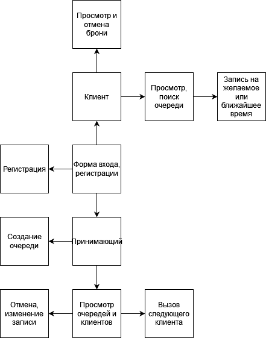
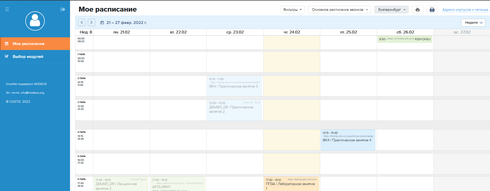

# Электронная очередь
***
## 1. Цель проета
* Цель проекта - создать web-приложение с функцией электронной очереди.
***
## 2. Требования к продукту
### 1. Основные требования:
   1. Вход на сайт с заранее созданной учетной записи.
   2. Постановка на одну из очередей в желаемое свободное время или в ближайшее.
   3. Просмотр пользователем всех забронированных мест, аннулирование брони.
### 2. Дополнительные требования:
   1. Регистация пользователей и изменение профиля.
   2. 2 типа пользователей: клент и принимающий.
   3. Рассчет примерного времени ожидания.
   4. Информирование клиентов об изменении расписания
***
## 3. Логика работы
### 1. Типы пользователей:
* <b><i>Клиент</i></b> - может выбрать любое свободное время в любой очереди или записаться на ближайшее
возможное, просмотреть свои брони и отменить их.
* <b><i>Принимающий</i></b> - может создать очередь, установить норму времени на прием одного клиента и перерыв,
изменить очередь, вызвать следующего клиента.
### 2. Примерное время приема:
* За клиентом закрепляется заранее выбранное время, но в случае десинхронизации реальное время
ожидания может измениться.
* Система будет рассчитывать среднее время приема клиента и на его основе находить предполагаемое
время ожидания.
### 3. Схема:
* 
***
## 4. Технологический стек
* frontend: angular, scss, html.
* backend, если будет: asp или express, mongodb + framework для работы с бд.
* Библиотека для авторизации пользователей ещё не выбрана.
* Развертывание frontend может быть выполнено на [vercel](vercel.com), 
backend на [microsoft azure](https://portal.azure.com/).
***
## 5. Дизайн
* За основу дизайна планируется взять сайт [modeus.org](https://urfu.modeus.org)

